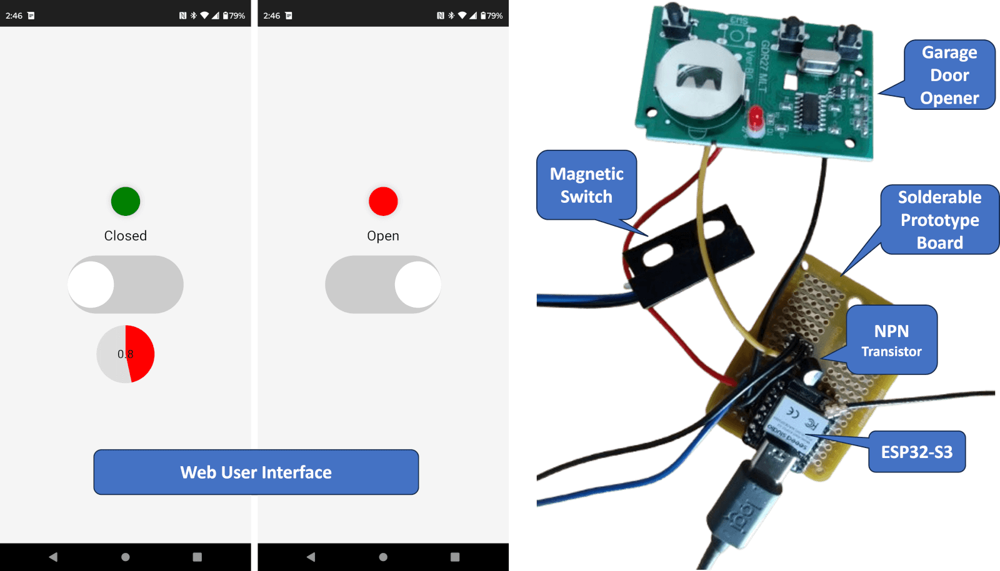
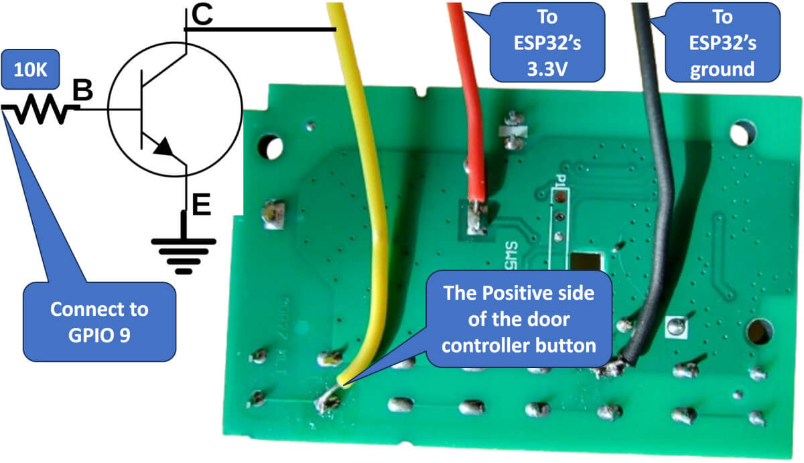
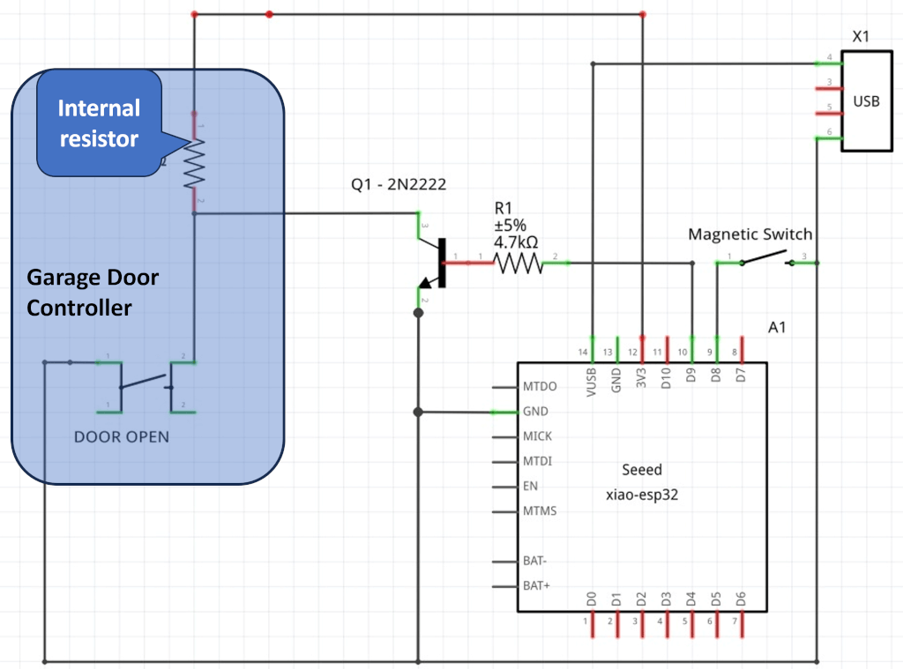

# Web-Based Remote Garage Door Controller

### This project aims to create a remote garage door controller without modifying the existing garage door unit.

The design uses a spare remote garage door controller powered directly by the ESP32's 3.3V output and a low-cost magnetic (reed) switch to detect the door's open/closed state. The magnet is mounted on the garage door, and the reed sensor is installed on the adjacent wall. The figure below shows the finished wiring. The electronics were mounted above the magnetic switch in a box.



**Figure 1: The complete garage door controller, including web  based UI and hardware**

The design shown in Figure 1 minimizes installation effort and eliminates the need to modify the garage door unit itself.

## Schematics Overview

The garage door controller operates directly from the ESP32's 3.3V output.  Before proceeding with the wiring, program the controller to ensure compatibility with your garage door system. Remove the batteries from the remote, as the ESP32 will provide power.

Using an NPN transistor instead of a relay simplifies the setup. The figure below demonstrates the connections. The transistor is used to simulate a button press by pulling a GPIO pin on the garage door controller low, effectively mimicking a garage door button click.



**Figure 3: The three cables soldered onto the garage door controller**

As you can see from the above image, the transistor's emitter is connected to the ESP32's ground. The transistor's collector is connected to the positive side of the door controller button. Internally, the garage door controller is connected to an internal GPIO pin; thus, by energizing the transistor via the base, the GPIO on the door controller is pulled low, simulating a garage door controller button click.

## Components Used

Here are the main components I used for this project, though any compatible component can be used:

* [**XIAO ESP32S3**](https://www.amazon.com/ESP32S3-2-4GHz-Dual-core-Supported-Efficiency-Interface/dp/B0BYSB66S5/)
* [**Garage Stop**](https://www.amazon.com/dp/B07Y3V5MC4) (generic garage door controller)
* [**NC Magnetic Switch**](https://www.amazon.com/dp/B085XQLQ3N) (Reed Switch)
* [ElectroCookie Mini PCB Solderable Prototype Board](https://www.amazon.com/gp/product/B081MSKJJX/)
* [Basic Starter Kit for Arduino](https://www.amazon.com/gp/product/B01HRR7EBG/) (includes breadboard, NPN transistor, 10K resistor, and cables)

## Hardware Instructions



**Wiring Instructions:**
* **Garage Door Controller Wiring:**
  * Solder three cables onto the garage door controller (as shown in Figure 3).
  * Connect the power to the ESP32's 3.3V output and ground to the ESP32's ground.
* **Transistor Connections:**
  * Connect the collector of the transistor to the positive side of the garage door controller button.
  * Attach the emitter to the ground.
  * Connect the transistor's base to a 4.7K to 10K resistor. Connect the other side of the resistor to the ESP32's GPIO 9.
* **Magnetic Switch Wiring:**
  * Ground the magnetic switch by connecting its ground wire to the ESP32's ground.
  * Connect the NC (Normally Closed) pin of the switch to GPIO 8 of the ESP32.


## Garage Door App Software Instructions

This project includes ready-to-use source code. You can use the code as is, but it is very easy to change it since the code running on the ESP32 is implemented in the Lua scripting language. The code can be used without modifications if you use the same GPIO numbers I used in my design.

The Lua code is designed for the Xedge32 development environment, which is very easy to install since it can be installed directly from the browser onto the ESP32.

* **Install the Development Environment:**
  * [Install the Xedge32 development environment](https://realtimelogic.com/downloads/bas/ESP32/).
  * Start with the [introductory Xedge32 tutorial](https://realtimelogic.com/articles/Your-First-Xedge32-Project) to become familiar with the IDE.
* **Prepare the Software:**
  * Clone the project repository from GitHub.
  * Navigate to the project directory (cd DoorController/app).
  * Compress the app directory into a ZIP file (e.g., DoorController.zip), ensuring the directory name is excluded. As an example, the index.lsp file must be at the root of the ZIP for the app to function.
  * Example:
  ```
  git clone https://github.com/jjsch-dev/DoorController
  cd DoorController/app
  zip -D -q -u -r -9 ../DoorController.zip .
  
  ```
* **Upload the Application:**
  * Open the Xedge32 IDE at [http://xedge.local/rtl/](http://xedge.local/rtl/).
  * Click on the menu icon (three dots) in the top-right to open the IDE menu.
  * In the IDE menu, click "Firmware Update & App Upload."
  * Drag and drop DoorController.zip onto the upload page.
  * Choose the unpack option if you plan to modify the code. Otherwise, deploy it directly.
  * Click Save to finish uploading.
* **Run and Test:**
  * Verify that the app is running with no errors in the Xedge32 console.
  * Set the console trace level to 10 for detailed printouts from the app.
  * Access the garage controller interface at http://xedge.local/ in a separate browser window. Enter a username and password and click the Save button. Login using the credentials you set.
  * You should see the garage door on/off button after logging in. Hold the on/off button for 1.5 seconds to open/close the door.
  * Move the magnet near the reed switch to test the door's open/closed state. The switch should register as "closed" when the magnet is near and "open" otherwise.


### How the Login Mechanism Works

After the initial login, the door app remembers your browser client by storing a fingerprint. This fingerprint includes the IP address of the client (the phone). Once logged in, the browser won't require you to re-enter the password as long as it is accessed at least once every 30 days. If the client's IP address changes, the fingerprint becomes invalid, and you'll be prompted to log in again.

### Preventing Re-Entering The Password With Address Reservation

To avoid issues caused by changing IP addresses (common with dynamic IP allocation on home networks), you can use **Address Reservation** , a feature available on most home routers. Here's how to set it up:

1. Log in to your home router's admin interface (usually accessible via a browser at an address like 192.168.0.1 or 192.168.1.1).
2. Locate the **DHCP Settings** or **Address Reservation** section.
3. Find the phone and its MAC address. This is typically displayed in the router's connected devices list.
4. Assign a fixed (static) IP address to the phone using the phone's MAC address.


# Password-Protecting the Xedge32 IDE

In addition to the credentials you set for the garage door app, you should also enable password protection to secure your Xedge32 IDE and prevent unauthorized access. This ensures that only authorized users can modify the garage door controller app or settings. Follow these steps:

* Open the Xedge32 IDE by navigating to http://xedge.local/rtl/ using your browser. Click on the menu icon (three dots) in the top-right corner and select "Settings."
* Set Up a Password:
  * Select "Authentication" in the settings menu.
  * Enter a username and a strong password that is difficult to guess. The username and password should not be the same as the one you used for the garage door app.
  * Click Save and make sure the browser remembers the password. The Xedge32 IDE does not provide password recovery.

# Using the Garage Door Controller on a Mobile Phone

To conveniently access the garage door controller from your mobile device, follow these steps:


1. **Open the Door Controller:**
    * On your mobile phone, navigate to http://xedge.local in your web browser.
2. **Add to Home Screen:**
    * On iPhone: Tap the share button (usually a square with an arrow pointing up) and select "Add to Home Screen."
    * On Android: Tap the three-dot menu in the browser and choose "Add to Home screen."
    
    Once added, the web-based user interface will appear as a native app icon on your home screen. Tapping this icon will instantly open the garage door controller.
    
3. **WiFi Requirements:**
    * Ensure your mobile device is connected to the same WiFi network as the ESP32. Since the ESP32 is not accessible via the public Internet, it requires a local connection to function.
    * Verify that your WiFi signal is strong enough to reach your driveway. A weak signal may prevent the controller from working reliably when you're pulling up to your garage.

## Enable Email Logging for Door Status Updates

You can receive email notifications about the garage door's open/closed status by configuring the SMTP settings in Xedge32. Follow these steps to set it up:

1. **Configure SMTP:** Refer to the tutorial [How to Send Emails with Xedge](https://realtimelogic.com/articles/How-to-Send-Emails-with-Xedge-IDE-A-StepbyStep-Guide) for guidance on setting up SMTP. Note that you only need to complete the SMTP configuration section; the rest of the tutorial is not required for this feature.

2. **Receive  Notifications:** Once configured, the app will automatically send email updates to your specified address whenever the garage door opens or closes.

# Source Code File Overview

The application implements a global reactive state, ensuring seamless real-time synchronization across multiple browser clients. This functionality is built using the programming pattern described in the tutorial [Modern Approach to Embedding a Web Server in a Device](https://realtimelogic.com/articles/Modern-Approach-to-Embedding-a-Web-Server-in-a-Device).

The following table outlines a short description of each file included in the project:

| **File** | **Description** |
| --------- | --------------- |
| **.config** | Contains [Xedge auto-installation configurations](https://realtimelogic.com/articles/Mastering-Xedge-Application-Deployment-From-Installation-to-Creation) for the app, ensuring easy drag and drop installation. |
| **.preload** | Implements the application's core logic and initializes essential components required for the app's operation. |
| **index.lsp** | Powers the user interface with Alpine.js and JavaScript, enabling the button functionality for controlling the garage door. The Alpine.js powered code was generated by ChatGPT. |
| **login.lsp** | Manages the password setup and login functionality, ensuring access control for the garage door controller app. The UI for this page was also created by ChatGPT. |
| **manifest.json** | Provides metadata for mobile app integration, including details for adding the web app to a home screen. |
| **smq.lsp** | Handles [SMQ](https://realtimelogic.com/products/simplemq/) connection requests initiated from `index.lsp`. |

### `.lua` Directory

This folder contains Lua modules loaded by `.preload`.

| **File** | **Description** |
| -------- | --------------- |
| **db.lua** | Encrypted user database logic utilized by `login.lsp`for storing and verifying user credentials. |
| **EdgeDetectSensor.xlua** | A generic GPIO edge detector script for monitoring changes in sensor states, such as the reed switch. |

### `images` Directory

This folder includes icon assets used for mobile app installations.
